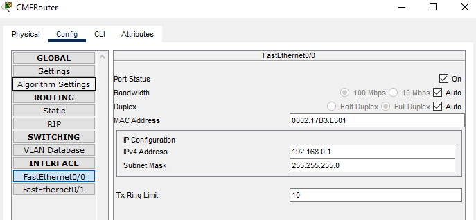

University: [ITMO University](https://itmo.ru/ru/)  
Faculty: [FICT](https://fict.itmo.ru)  
Course: [IP-telephony](https://github.com/itmo-ict-faculty/ip-telephony)  
Year: 2022  
Group: K34202  
Author: Efimov Pavel Leonidovich  
Lab: Lab1  
Date of create: 18.03.2023
Date of finished: 

Цель работы: Изучить рабочую среду Cisco Packet Tracer, ознакомиться с интерфейсами основных устройств, типами кабелей, научиться собирать топологию. Изучить построение сети IP-телефонии с помощью маршрутизатора, коммутатора и IP телефонов Cisco 7960 в среде Packet tracer

Ход работы:
###Часть 1

1. Изучена теоретическая и практическая части лабораторной работы

2. Собрана схема соединения

3. Настроены коммутаторы и компьютеры для полноценной работы сети.

4. Применен основной список команд для конфигурирования устройств сети.

5. Выполнена проверка, что любой компьютер одной сети посредством пинга передает пакеты любому компьютеру другой сети.

###Часть 2

1. Собрана схема соединения.
2. Изменено имя маршрутизатора на CMERouter.

3. Настроен интерфейс fa0/0 на маршрутизаторе Cisco 2811 (CMERouter).

4. Настроен DHCP сервер для передачи голоса и данных на маршрутизаторе - Cisco 2811.
5. Настроены услуги телефонии Cisco CallManager Express на маршрутизаторе 2811. 
6. Настроена маршрутизация сети.

7. Созданы VLAN порты на коммутаторе для взаимодействия коммутатора с маршрутизатором и подключить IP телефоны.

8. Настроены IP-телефоны, присвоить им номера и соединить с коммутатором.
9. Проверены звонки между телефонами и проверить остальные сервисы (перевод звонков, конференц-связь, перехват звонка).

Вывод:
В ходе выполнения работы были изучена рабочая среда Cisco Packet Tracer, ознакомлены с интерфейсами основных устройств, типами кабелей, собрана топология. Изучено построение сети IP-телефонии с помощью маршрутизатора, коммутатора и IP телефонов Cisco 7960 в среде Packet tracer
