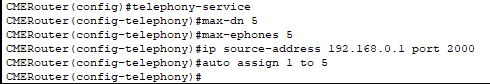

University: [ITMO University](https://itmo.ru/ru/)  
Faculty: [FICT](https://fict.itmo.ru)  
Course: [IP-telephony](https://github.com/itmo-ict-faculty/ip-telephony)  
Year: 2022  
Group: K34202  
Author: Efimov Pavel Leonidovich  
Lab: Lab1  
Date of create: 19.03.2023  
Date of finished: 

Цель работы: Изучить построение сети IP-телефонии с помощью маршрутизатора Cisco 2811, коммутатора Cisco catalyst 3560 и IP телефонов Cisco 7960.

Ход работы:
###Часть 1

1. В конфигурационном режиме изменено название маршрутизатора на CMERouter.
2. Отключен синтаксис ввода слов от DNS серверов.

3. Задан пароль для защиты маршрутизатора как в удаленном режиме, так и в режиме консоли.

4. Настроен интерфейс fa0/0 на маршрутизаторе Cisco 2811 (CMERouter).

5. Настроен DHCP сервер для передачи голоса и данных на маршрутизаторе Cisco 2811. 

6. Настроены услуги телефонии Cisco CallManager Express на маршрутизаторе 2811. 

7. Созданы VLAN порты на коммутаторе Cisco Catalyst 3560 для взаимодействия коммутатора с маршрутизатором и подключены IP телефоны. 
8. 

8. Настроены IP-телефоны и соединены с коммутатором Cisco Catalyst 3560. 

9. Проверены звонки между телефонами и проверены остальные сервисы (перевод звонков, конференц-связь, перехват звонка).

###Часть 2
1. Созданы VLAN порты на коммутаторе для взаимодействия коммутатора с маршрутизатором и подключены IP телефоны. 

2. Заданы маршруты по умолчанию командой ip default-gateway.
3. Настроен порт как канал типа trunk. 

4. Настроены DHCP сервера для передачи голоса и данных на маршрутизаторе Cisco 2811. 

5. Настроены услуги телефонии Cisco CallManager Express на маршрутизаторе. 

6. Настроены IP-телефоны и соединить с коммутатором. 

7. Подключены конечные узлы устройств. 
8. Проверены звонки между телефонами и проверены остальные сервисы (перевод звонков, конференц-связь, перехват звонка).

Вывод:
В ходе выполнения работы было изучено построение сети IP-телефонии с помощью маршрутизатора Cisco 2811, коммутатора Cisco catalyst 3560 и IP телефонов Cisco 7960.