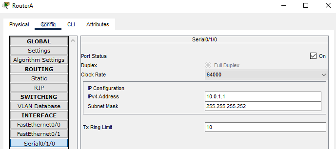

University: [ITMO University](https://itmo.ru/ru/)  
Faculty: [FICT](https://fict.itmo.ru)  
Course: [IP-telephony](https://github.com/itmo-ict-faculty/ip-telephony)  
Year: 2022  
Group: K34202  
Author: Efimov Pavel Leonidovich  
Lab: Lab4  
Date of create: 26.03.2023  
Date of finished: 

Цель работы: Изучить построение сети IP-телефонии между удаленными филиалами с помощью маршрутизаторов Cisco 2811 и коммутаторов Cisco 2950Т. Изучить построение сети IP-телефонии между удаленными филиалами с помощью маршрутизаторов Cisco 2811 и Cisco 2600XM.

Ход работы:
###Часть 1
1. Настроен интерфейс fa0/0 на маршрутизаторах Cisco 2811.

2. Настроен интерфейс s0/3/0 на маршрутизаторах Cisco 2811.

3. Настроен маршрутизатор Cisco 2811, коммутатор Cisco 3950Т, IP-телефоны аналогично лабораторной работе №2.
4. Настроен DHCP сервера на маршрутизаторах для передачи голоса и данных между ними.

5. Настроена динамическая маршрутизация RIP между маршрутизаторами для передачи информации друг другу.

6. Настроены услуги телефонии Cisco CallManager Express на маршрутизаторе 2811.

7. Командой switchport mode access сконфигурированы выбранные порты коммутатора, как порты доступа (аксесс порт). Командой switchport access vlan 1 указаны, что данные порты является портом доступа для vlan с номером 1.

8. Проверены вызовы между удаленными IP-телефонами.

Вывод:
В ходе выполнения работы было изучено построение сети IP-телефонии между удаленными филиалами с помощью маршрутизаторов Cisco 2811 и коммутаторов Cisco 2950Т, изучено построение сети IP-телефонии между удаленными филиалами с помощью маршрутизаторов Cisco 2811 и Cisco 2600XM.